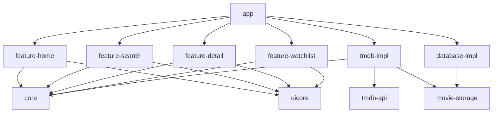

# SceneSeek 🎬

A modern Android app for discovering movies and TV shows, built with Clean Architecture, Jetpack Compose, and the TMDB API.

## Architecture

SceneSeek follows **Clean Architecture** with a multi-module Gradle project:



### Layers

| Layer | Modules | Responsibility |
|-------|---------|----------------|
| **Presentation** | `:feature-*` | ViewModels, Screens, UI State |
| **Domain** | `:core` | Models, Repository interfaces, UseCases |
| **Data** | `:tmdb-impl`, `:database-impl`, `:movie-storage` | Retrofit, Room, Hilt modules |
| **UI Components** | `:uicore` | Shared composables, Material3 theme |

### Tech Stack

- **UI**: Jetpack Compose + Material3
- **DI**: Hilt
- **Networking**: Retrofit 2 + OkHttp + Moshi
- **Database**: Room (offline-first)
- **Image Loading**: Coil
- **Navigation**: Navigation Compose
- **Architecture**: MVVM + Clean Architecture
- **Testing**: JUnit4 + MockK + Turbine + Coroutines Test

## Setup

### Prerequisites

- Android Studio Hedgehog or later
- JDK 17
- A TMDB API key ([get one free](https://developer.themoviedb.org/docs/getting-started))

### Getting Started

1. **Clone the repository**
   ```bash
   git clone https://github.com/yourusername/SceneSeek.git
   cd SceneSeek
   ```

2. **Add your TMDB API key**

   Create or edit `local.properties` in the project root:
   ```properties
   tmdb_api_key=YOUR_API_KEY_HERE
   ```

3. **Sync and run**

   Open in Android Studio → wait for Gradle sync → Run on device/emulator.

### Building from CLI

```bash
./gradlew assembleDebug                    # Build debug APK
./gradlew testDebugUnitTest                # Run unit tests
./gradlew lintDebug                        # Run lint
```

## Module Graph

- **`:app`** — Application class, NavHost, bottom navigation
- **`:core`** — Domain models, repository interfaces, Result type
- **`:uicore`** — Material3 theme, shared Composables (MediaCard, PosterImage, ShimmerEffect)
- **`:tmdb-api`** — Retrofit service interfaces + Moshi DTOs
- **`:tmdb-impl`** — OkHttp/Retrofit/Hilt wiring, repository implementations
- **`:movie-storage`** — Room entities and DAOs
- **`:database-impl`** — AppDatabase, Hilt database module
- **`:feature-home`** — Home screen with trending + popular content
- **`:feature-search`** — Debounced multi-search (movies + TV)
- **`:feature-detail`** — Detail screen with cast, trailers, similar titles
- **`:feature-watchlist`** — Saved titles with swipe-to-dismiss
- **`:testutils`** — TestDispatcherProvider for coroutine testing

## Commit Style

```
type(scope): description

feat(home): add HomeViewModel with parallel content loading
fix(tmdb-impl): handle 401 auth errors in NetworkResultMapper
test(repository): add offline-first cache fallback tests
docs: update README setup instructions
```

## License

MIT
